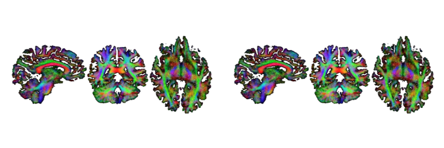

# Project Portfolio
This is my project portfolio. My dream is that all people will be enabled with the independence to fully live their lives.

My Interests | Cool Skills 
:---:|:---:
Neuroscience | Cortical Circuit Dynamics
Computer Science | SNNs & Unsupervised Learning
Dynamical Systems | Signal Processing
Kart Racing | Tractographic Reconstruction

## Projects / Publications

### [2026] THALis: Modeling Cortico-Prosthetic Dynamics for Dexterous EEG-driven Hand Control

**[_IN PROGRESS_]** The goal of this project is to develop a noninvasive prosthetic hand control algorithm and architecture for fine, dexterous motor control of the hand. This project proposes a new neurocomputational framework for non-invasive prosthetic control that integrates insights from computational neuroscience, nonlinear dynamics, and spiking neural networks (SNNs). The central hypothesis is that the fundamental emergent properties of neural activity—including chaotic dynamics, synchronization, and nonlinear attractor behavior—are partially reflected in scalp EEG, but obscured by low SNR (signal to noise ratio) and conventional linear processing. By developing a novel EEG transformation grounded in chaos and dynamical systems theory, this project aims to amplify these emergent signatures, yielding richer neural features than traditional spectral approaches.

The broader motivation is twofold: 
  (1) to expand the functional capacity of non-invasive prosthetic hands for amputees who cannot access invasive brain–computer interfaces, and 
  (2) to demonstrate that computational neuroscience principles—emergent dynamics, SNN plasticity, and multimodal neural fusion—can concretely enhance assistive neurotechnology.

[Insert images here]

#### Resources:
- **Github Repo:** [https://github.com/blizzard-labs/thalis-eeg-control](https://github.com/blizzard-labs/thalis-eeg-control)
- **Project Proposal:** [https://docs.google.com/document/d/135vfImX9XZffEkq6f2IK6FvMbcDsl175/preview](https://docs.google.com/document/d/135vfImX9XZffEkq6f2IK6FvMbcDsl175/preview)

### [2025] ReconBench: A Phylogenetic MCMC Benchmark
Reconstructing ancestral sequence histories is a cornerstone of evolutionary biology, providing insight into the mechanisms of molecular evolution, protein function, and phylogenetic relationships. Accurate ancestral inference requires not only modeling substitutions but also realistically accounting for insertions and deletions (indels), which complicate both alignment and tree estimation. While tools such as Historian have been developed to jointly reconstruct alignments and ancestral states under probabilistic models, systematic benchmarking across diverse evolutionary scenarios remains limited.

The purpose of this work was to design and implement a comprehensive evaluation framework for Historian, enabling rigorous testing across a wide range of phylogenetic conditions. Using INDELible to simulate evolutionary histories, we generated biologically-derived datasets spanning the four major SCOP protein types containing a diversity of balanced and unbalanced trees, star-like and pectinate structures, variable branch lengths, substitution rates, and indel regimes. These simulations provided a controlled ground truth against which to assess reconstruction accuracy, runtime performance, and robustness.

[Insert Images here]

#### Resources:
- **Publication:** _Forthcoming, Oxford Press_
- **Github Repo:** [https://github.com/blizzard-labs/phylo-mcmc-evaluation](https://github.com/blizzard-labs/phylo-mcmc-evaluation)
- **Project Report:** [https://drive.google.com/file/d/1ch-W26xjg0PbhFo8QuBGvkchhoeWDRs0/preview](https://drive.google.com/file/d/1ch-W26xjg0PbhFo8QuBGvkchhoeWDRs0/preview)
- **Project Proposal:** [https://docs.google.com/document/d/1KL2TiRQIa24yCigaRSZ2z2lLPYo_lPbwzhAoLqaPTOw/preview](https://docs.google.com/document/d/1KL2TiRQIa24yCigaRSZ2z2lLPYo_lPbwzhAoLqaPTOw/preview)
- **Modified Historian:** [https://github.com/blizzard-labs/historian-mod](https://github.com/blizzard-labs/historian-mod)

### [2025] HomeBuilt: Your DIY Home Improvement Partner
Remodeling outdoor spaces is challenging for homeowners, while hiring contractors is costly and uncertain. Meanwhile, small hardware stores struggle to compete with larger chains, leaving them with unsold stock. Our solution is the HomeBuilt app, an easy method for users to create their own customized projects with curated materials and instructions. After choosing a starter project from HomeBuilt’s extensive library of different designs, users can use Benji, our  AI assistant, to customize their design to perfection. We will provide the following customizable renovation options: Fencing, tiling, pet-houses, sheds, doors, landscaping, carpentry, and other projects. After the DIY  design has been completed, HomeBuilt will take it a step further than traditional AR home design apps and provide materials and an easy-to-follow instruction manual. The materials will be sourced from local hardware suppliers that HomeBuilt will partner with, giving them business and a larger market reach.

[Insert Images here]

#### Resources: 
- **Launch Writeup:** [https://drive.google.com/file/d/1K063vRwWWBMYVAiNsq_a-sU5c8eeiPUm/preview](https://drive.google.com/file/d/1K063vRwWWBMYVAiNsq_a-sU5c8eeiPUm/preview)
- **Video Pitch:** [https://youtu.be/yTSA3R-rAMo](https://youtu.be/yTSA3R-rAMo)
- **Customer Testimonials:** [https://drive.google.com/file/d/1EJ36i9EDGFnBcR54bqFN0lnPjuB8OVlu/preview](https://drive.google.com/file/d/1EJ36i9EDGFnBcR54bqFN0lnPjuB8OVlu/preview)
- **Projected Financials:** [https://drive.google.com/file/d/135MnpNRTZMCb0eRc79KxdawN26TGmKgo/preview](https://drive.google.com/file/d/135MnpNRTZMCb0eRc79KxdawN26TGmKgo/preview)

### [2025] MesoNet: Optimizing Spiking Neural Networks with Dynamic Saddle Distributions
Artificial neural network (ANN) clustering algorithms require hundreds of watts, considerably  limiting their abilities across numerous energy-critical applications. A developing technology, spik-  ing neural networks (SNNs) offer a promising alternative, requiring mere milliwatts by mimicking  biological neurons on neuromorphic chips. However, the prevalent spike-timing-dependent-  plasticity (STDP) learning rule struggles to scale for practical tasks, reducing accuracy by up to  40% compared to ANNs. This paper addresses these challenges with a two-step approach: mathe-  matically investigating SNN learning behavior with dynamical systems theory, before developing  an algorithm for improved generalization. We identify an optimal learning regime at the edge of  chaos and introduce two algorithms- variable plasticity and triangulated attribution- maintaining  these optimal learning conditions. Notably, these mechanisms dynamical form and annihilate  saddle points to enhance representations. Implemented in a split-and-merge architecture, our  network MesoNet implements these algorithms to achieve performative improvements in accuracy  and information retention.

[Insert Images here]

#### Resources:
- **Preprint:** [https://doi.org/10.5281/zenodo.17771306](https://doi.org/10.5281/zenodo.17771306)
- **Github Repo:** [https://github.com/blizzard-labs/NMCtests](https://github.com/blizzard-labs/NMCtests)
- **Video Presentation:** [https://youtu.be/4yPmUsaXKY0](https://youtu.be/4yPmUsaXKY0)
- **Poster Presentation:** [https://drive.google.com/file/d/1kDdw0U7FfciGSA6t0wHDR0jmJ54sKUvg/preview](https://drive.google.com/file/d/1kDdw0U7FfciGSA6t0wHDR0jmJ54sKUvg/preview)
- **Project Journal:** [https://drive.google.com/file/d/1tlKrL9USkRzOWsZpzvfb4f4PNb1Pr5h_/preview](https://drive.google.com/file/d/1tlKrL9USkRzOWsZpzvfb4f4PNb1Pr5h_/preview)

### [2024] TractX: A Density-Aware Streamline Exclusion System for Accurate White Matter Reconstruction
White matter tractography is a non-invasive diffusion-imaging tool essential to analyzing brain connectivity; it is the most prevalent system for pre-operative and research-based analysis. However, it faces challenges from erroneous methodologies ignoring bottleneck regions where multiple white matter bundles converge before diverging. This results in false-positive paths in around ~70% of voxels (3D MRI pixels) and an exceedingly low precision of ~23%. TractX aims to resolve bottlenecks through a three-part pipeline of systematic identification and alteration utilizing a novel nerve-density-analysis architecture. The prototype initially conducts Constrained Spherical Deconvolution (CSD) on 1mm dMRI images to produce a field orientation distribution (FOD) of individual voxels. The FOD is then parsed to a bottleneck identification system in which fiber-vectors assigned to multiple bundles are extracted alongside relevant data, including fiber-density and associated voxels. Next, the data is transformed into a feature vector representing selectively weighted characteristics of the bottleneck through a linear regression model trained with gradient descent. An Approximate Nearest Neighbors procedure deconstructs the vector into a low-dimensional space before streamlines are associated by distance in the vector space. Finally, TractX regenerates bottlenecks through CSD, connecting in and out fibers. After comparison against HCP-based ground truth datasets, the TractX pipeline produced a recall of 94.52% and a precision of 72.83%. The novel architecture demonstrated an unprecedented and phenomenal gain in precision score, 216.15% higher than current state-of-the-art pipelines. Accessed through command-line interface, TractX has great promise for improving tractography results and reliability by over two-hundred-fold across innumerable applications.

[Insert pictures here]

#### Resources:
- **Github Repo:** [https://github.com/blizzard-labs/tractx-no-maps](https://github.com/blizzard-labs/tractx-no-maps)
- **Poster Presentation:** [https://drive.google.com/file/d/1msfSQkJJBQ3r8podPtQThE3YrCb9IFjb/preview](https://drive.google.com/file/d/1msfSQkJJBQ3r8podPtQThE3YrCb9IFjb/preview)

### [2023] Balancerator: A Wearable for Active Prevention of Falls Through GRU-based Gyroscopic Inference and Center of Mass Manipulation
Freezing of gait along with balance dysfunctions is a widespread cause of severe injuries worldwide, making them one of the largest causes of fatality for elderlies above 65. The project’s goal is to lower falling rates for individuals with balancing dysfunctions without weakening brain-muscle activations, an effect of other walking aids. My prototype is an Arduino UNO-controlled wearable, which manipulates the user’s center of mass (CoM) with 1.8-kilogram weights on each side based upon their inclination, captured by a gyroscope. The prototype is interfaced through a mobile app with emergency contact capabilities and walking pattern trends for doctors. Various hardware models were developed through iteration with the final design being optimized for equally distributed load, battery life longevity, and maximum CoM displacement. Various software models were also developed to eliminate gyroscopic noise and to determine the state of the user. In the final iteration, Kalman filtration was utilized alongside Gaussian Motion and Bayes’ theorem to compare the prediction and update curve of the gyroscope to remove noise. In addition to this, a Recurrent Neural Network variant, the Gated Recurrent Unit (GRU), was trained through stochastic gradient descent to classify the position of the user as walking, standing, or unbalanced. After an overall 1,400 data points were collected, the gyroscope had 93.3% less bias, the GRU had an F1-score of 0.9369, and the device had a 70.5% lower fall rate than without it. The device has great potential to reduce falling rates without adverse effects.

[Insert pictures here]

#### Resources:
- **Project Spotlight:** [https://www.societyforscience.org/jic/2023-student-finalists/krishna-bhatt/](https://www.societyforscience.org/jic/2023-student-finalists/krishna-bhatt/)
- **Video Presentation:** [https://youtu.be/ve8pqWtbBm0](https://youtu.be/ve8pqWtbBm0)
- **Project Poster:** [https://drive.google.com/file/d/162AHb5D_bjp-7TEQn_o3OxmyVhgVhEBL/preview](https://drive.google.com/file/d/162AHb5D_bjp-7TEQn_o3OxmyVhgVhEBL/preview)
- **Github Repo:** [https://github.com/blizzard-labs/balancerator](https://github.com/blizzard-labs/balancerator)

### [2022] Cookie dispenser: A Device to Limit Obesity
My project has a goal of making children less prone to obesity by reducing the amount of calories children consume each day. I went about it by creating a child-friendly cookie dispenser which dispenses one cookie everyday. I added a bluetooth module and created an application so it could be controlled through a smartphone. The prototype overcame all of the success criteria with 100% accuracy. It also overcame my project constraints of budget, materials, and time. This design has scope to greatly reduce obesity rates. However it has to be mass produced and adopted by households across the U.S.

#### Resources:
- **Project Poster**: [https://drive.google.com/file/d/1H4tsudnYg4-o26NanthVHXAIR48T0lyM/preview](https://drive.google.com/file/d/1H4tsudnYg4-o26NanthVHXAIR48T0lyM/preview)
- **Project Video:** [https://youtu.be/uDxKYNIIAQ0](https://youtu.be/uDxKYNIIAQ0)

## Non-Profit Work: Prabha

## Awards

**Science Fair:**
1. 1st Engineering ($3500) and Top 30 Finalist @ Thermo Fisher JIC [2024]
2. Alternate Grand Award (15/1000+) @ Synopsys Science Fair [2025]
3. IBM Award and Grant + Sponsored Awards ($900+ Total) [2024]
4. 1st, 3rd, 2nd Category Awards [2023, 2024, 2025]
5. Commendation by San Jose City Council [2022, 2023, 2024, 2025]

**Entrepreneurship:** 
1. Top 40/3000+ Business Finalist @ International Diamond Challenge [2025]
2. Secured 2 Official Local Business Partners (HomeBuilt) [2025]
3. Hosted text-based games (4000+ total players)

**Debate and Academics:**
1. 5th/10000+ Overall @ World Scholars Cup ToC Debate [2023]
2. 2x AP Scholar with Distinction [2024, 2025]
3. 9x Distinguished Honor Roll Student [2023, 2024, 2025, 2026]
4. KUMON Math and Reading Accomplishment [2021, 2022]

## Prior Experience
**Lead Computational Intern  @ Holmes Lab, UC Berkeley**

_JULY 2024 - SEPTEMBER 2025, BERKELEY (STANLEY HALL)_

Worked with  a team of six interns under the apprenticeship of Dr. Ian Holmes for 2024 and 2025 summers; closely worked with post-grads and professors in a lab environment.
- **Summer 2025**: Developed "ReconBench," a benchmarking suite for MCMC evolutionary reconstructors utilizing biologically-inferred statistical models of evolution to generate synthetic datasets capable of precisely measuring performance statistics for development.   
- **Summer 2024**: Worked on data engineering pipelines to map together structural protein data with phylogeny data to identify key evolutionary segments in protein families and visualize them with an integrated protein visualizer.

**Independent Researcher / Engineer**

_JUNE 2022 - PRESENT,  SAN JOSE_

Developed various passion engineering projects presented at science fairs, research symposiums, and hackathons, winning various awards.
- **THALis**: Modeling Cortico-Prosthetic Dynamics for Dexterous EEG-driven Hand Control [IN PROGRESS]
- **MesoNet**: Optimizing Spiking Neural Networks with Dynamic Saddle Distributions [2025, YouTube, Publication Draft]
- **TractX**: A Density-Aware Streamline Exclusion System for Accurate White Matter Reconstruction [2024]
- **Balancerator**: A Wearable for Active Prevention of Falls Through GRU-based Gyroscopic Inference and Center of Mass Manipulation [2023, Youtube, To Be Patented]
In free time, enjoys designing and constructing various passion projects ranging from a Touch-ID protected cookie dispenser to experimental boat designs and walkie-talkies. Loves applying engineering skills to create new inventions.

**Keynote Speaking**

_MAY 2024 - PRESENT,  SAN FRANCISCO BAY AREA_

Spoke at multiple TEDx keynote events and symposiums regarding topics revolving around emerging innovation and presentation techniques.
- **TEDxBISV ‘25**: Big Ideas, Little Time: The Science of Powerful Pitches [YouTube, Event Page]
- **NorCal JSHS ‘25**: MesoNet– Optimizing SNNs
- **TEDxBISV ‘24**: The Missing Steps to the Big Picture (And How to Find Them) [YouTube, Event Page]

## Education
### BASIS Independent Silicon Valley High School
- **GPA & Testing:** 4.75 (weighted, unranked), 4.0 UW, 1570 SAT
- **Major Course Load:** AP Calculus BC, AP Calculus AB, AP Computer
Science A, AP Biology, AP Physics C, AP Statistics, AP Psychology, AP
Physics I, AP Environmental Science, AP English Language, AP English
Literature, AP US History, AP US Government, AP Macroeconomics,
AP Microeconomics, AP World History

## Recent Books / Lecture Series

## Photo Gallery

